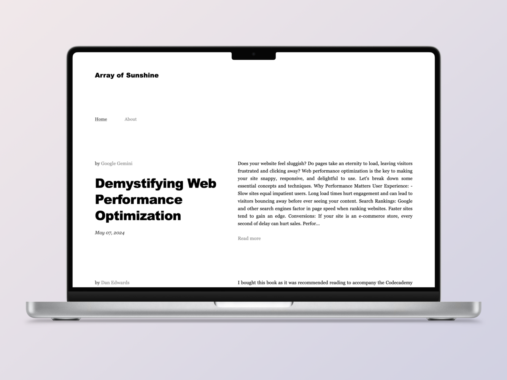
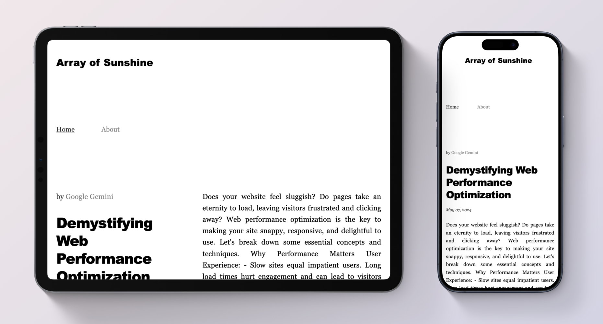
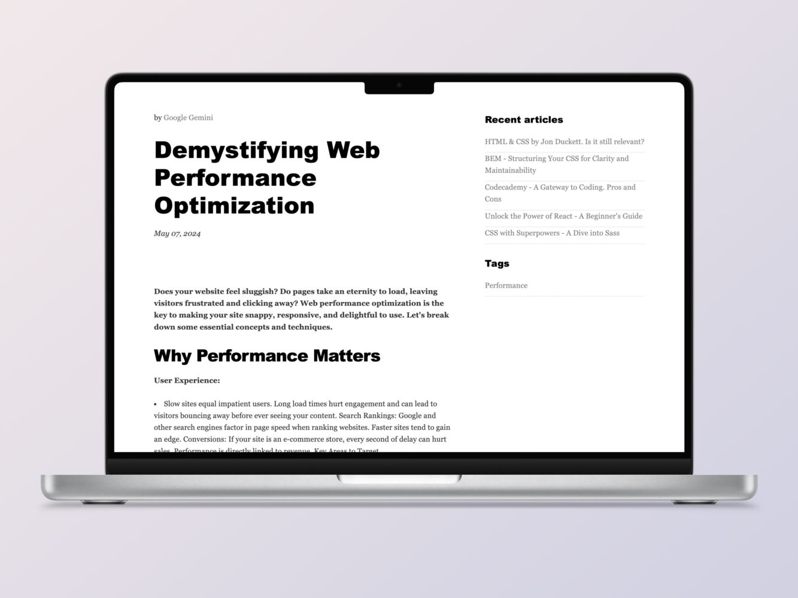
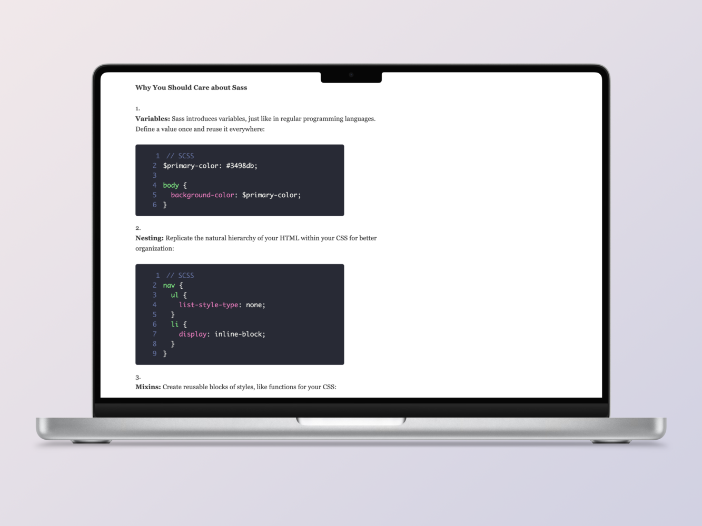
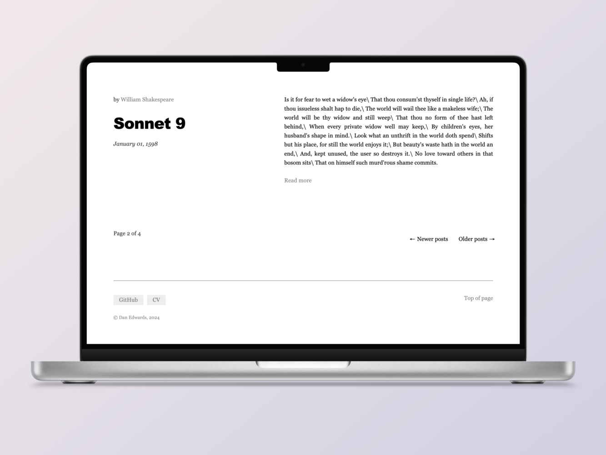
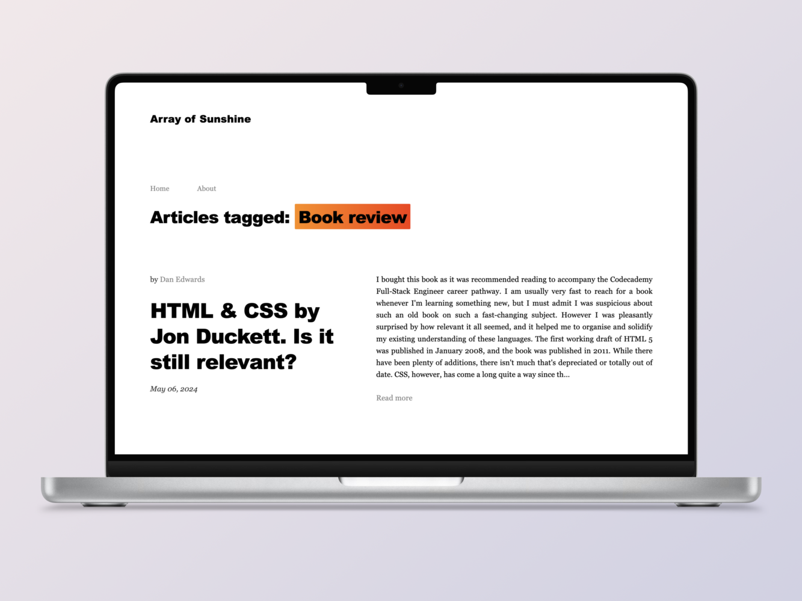

# Minimal coding blog made with React & Markdown

<a href="https://arrayofsunshine.co.uk/" target="_blank">
Deployed site: Array of Sunshine</a>

---

Homepage




---

Full article


---

Full article with code examples


---

Pagination


---

Filter term page - click on a tag or writer


### Technologies

-  React `v18.3.1`
-  React router `v6.23.0`
-  React markdown
-  React syntax highlighter
-  Reach Helmet
-  Redux Persist
-  Redux & toolkit
-  Sass

### To-Do List

-  [ ] Add metadata to tags and writer pages
-  [ ] Generate keywords and meta descriptions for all proper coding articles
-  [ ] Write another article
-  [ ] Remove Shakespeare articles
-  [ ] Rewrite About page

### Tests

-  Check that internal links don't contain problem punctuation
-  Check that length of `ARTICLES.json` matches number of files in `app/articles`

-  [ ] Write tests for localhost
-  [ ] Write tests for live site

### Features

-  Serverless easy-to-maintain React blog
-  High-performance web app that's lightening-fast
-  Each markdown article is converted into a web page
-  Supports code blocks
-  Minimal & responsive design
-  Articles automatically sorted chronologically
-  Markdown syntax is removed from the truncated previews to make the homepage look neat
-  Recent articles (on full article page) are displayed dynamically
-  Pagination is handled dynamically
-  Tags and writer collections handled dynamically

### Installation

1. Install dependencies `npm install`
2. Write `.md` articles in the following format, and add them to `src/app/articles`

```markdown
---
title: Why I Quit Hollywood and Started a Web Development Agency
date: January 01, 2016
writer: Lindsay Lohan
tags: Web Design, Celebrity
---

## Article content with markdown syntax

The Hollywood Hills shimmered in the distance, a constant reminder of the life I was leaving behind. Million-dollar contracts, screaming fans, and the intoxicating allure of the red carpet – it all felt like a faded dream. The truth was, the magic had dimmed. I craved a different kind of creation, something where my vision could truly take center stage. So, with a deep breath and a heart full of trepidation, I announced my retirement from acting. Trading scripts for code, I embarked on a new adventure.
```

3. Run `generateARTICLES.js`. `ARTICLES.json` will be overwritten.
4. Run `npm start` to start the live server or...
5. Run `npm run build` to build a deployable site

#### Troubleshooting

-  Check the `.md` metadata is formatted correctly. There is not much scope for error
-  The date must be exactly as formatted above
-  Tags are comma-separated
-  Check that punctuation in the title isn't causing issues with the path. Title cannot contain a colon.

### To-Do List

-  [ ] If you refresh the page while viewing an article, the state will change and the content will change. Install Redux Persist
-  [ ] Remove unused images & icons
-  [ ] Remove unused variables and rebuild
-  [ ] Make metadata / link sharing previews dynamic and enable image preview for all paths. Install Redux Helmet
-  [ ] Refactor some of the repetition in some of the components.
-  [ ] add `rel="noopener"` to Footer links
-  [ ] Styling of active nav link - make underline further away from text
-  [ ] Create an Error page / Component
-  [ ] Style the Error page with useful Back and Home buttons
-  [ ] Add conditional loading to the article page to handle errors gracefully
-  [ ] Write a test that checks that the number of objects in `articles.json` matches the number of `.md` files in `src/articles`
-  [ ] Social icons could be prettier
-  [ ] Implement loading progress bar at the top of the page
-  [ ] Style the scroll bar in the theme colours (Maybe - actually this could be annoying)
-  [ ] Clicking on home seems computationally expensive. Make more efficient, perhaps by expanding the state so that visibleArticles doesn't change when you click a filter term
-  [ ] Fix: Markdown code blocks: 1st line number is weirdly indented.
-  [ ] Enable code wrap
-  [ ] Add subtle fade-in animation to each article preview when scrolling down the homepage
-  [ ] Add copy buttons for each code block
-  [ ] Scroll to the top of the <article> element when clicking on a link
-  [ ] Make the (currently hidden) search bar functional
-  [ ] Organise `article.md` files into folders, ensuring they can still be read by `main.js`
-  [ ] Prevent incorrect article paths from displaying an empty page
-  [ ] Fancy bracket animation on site title. [CSS Bracket hover animation](https://codepen.io/adatg/pen/BGLVGL?editors=0100)
-  [ ] Blur link on mobile after clicking pagination links. Tried `event.target.blur()` but this didn't work. Other people on stackOverflow mention it also doesn't work for them

### To-Do List (Completed)

-  [x] Subsequent page URLs
-  [x] Clean up Pagination component
-  [x] Make the site responsive
-  [x] Nest the sass so it's neat
-  [x] Add screenshot to ReadMe
-  [x] Remove more characters from article slugs:
       `book-review-%7C-clean-code`
-  [x] Fix about page styling
-  [x] Replace the word 'author' with 'writer' everywhere for consistency
-  [x] Make FilterTermPage h1 say: 'Articles by' for writers, and 'Articles tagged:' for tags
-  [x] Rename TagPage FilterTermPage
-  [x] Turn each writer into a page of previews by that writer
-  [x] Handle edge cases for NextPrev articles. (Articles now go round in a circle. If you view the first article, the 'previous' article is the last article, and vice versa. Avoids conditional rendering and a styling issue, plus recommends more content)
-  [x] Enable dynamic pagination on individual articles (NextPrev)
-  [x] Remove spaces from tag slug (book%20review)
-  [x] Style filter term page
-  [x] Pagination on Tags pages
-  [x] Implement dynamic tags section
-  [x] Turn tags into links to Tag page
-  [x] Clicking on site icon or Home takes you to articles page 1
-  [x] Make recent article links work correctly
-  [x] Display recent articles dynamically
-  [x] Auto update footer copyright year with fallback
-  [x] Make markdown links open in a new tab
-  [x] Enable preview page sorted by tags
-  [x] Design a sidebar and dynamically display other relevant blog posts
-  [x] Tidy up Home page function
-  [x] Display the three most recent articles in the sidebar that aren't the current article
-  [x] Check article bodies for errors
-  [x] Enable dynamic pagination
-  [x] Add 'newer posts' link, which will be hidden on page one.
-  [x] Favicon
-  [x] Add line numbers to code blocks
-  [x] Turn preview text into a link
-  [x] Automatically scroll to the top of the page instantly when clicking on an article link
-  [x] Scroll smoothly when clicking on 'top of page' internal link
-  [x] Add styling to the markdown so it's consistent
-  [x] Generate author links
-  [x] Add code syntax highlighting using a library
-  [x] Remove the word 'post' from the codebase - I prefer the term 'article' and it should be consistent for clarity
-  [x] Display article tags on single article page
-  [x] Display article tags on home page
-  [x] Limit article previews to 5 most recent on home page
-  [x] This article: HTML & CSS by Jon Duckett. Is it still relevant? isn't displaying in full for some reason, possibly because I pasted it from Notion. Fix this error. Solution: wrote a function to find and replace problem characters a weird apostrophe that isn't an apostrope, and an nbsb that looks like a space. Removed question marks from the path
-  [x] Add a `removeProblemCharacters` function to `public/main.js` to prevent problems in `articles.json`
-  [x] Implement dynamic page title (browser tab) changes
-  [x] Buy domain name
-  [x] Add a brief site description to About page
-  [x] Homepage metadata
-  [x] Fix punctuation replacement error. Getting `isn"t` instead of `isn't` etc. Fixed! Prettify was messing everything up - solution was to wrap punctuation in backticks.
-  [x] Conditional rendering of 'Newer posts' & ''Older posts' nav as when appropriate
-  [x] Dynamic page titles when using pagination nav links
-  [x] Fix sidebar recent article paths
-  [x] Turn each tag into a link to a page of relevant article previews
-  [x] Update site title for tags & authors pages

## Useful resources

-  [Building a Markdown React blog - YouTube tutorial](https://www.youtube.com/watch?v=gT1v33oA1gI) All the React content is wildly out of date, but it's still helpful for converting mardown into JSON
-  [Enabling pagination in React](https://www.educative.io/answers/how-to-implement-pagination-in-reactjs)
-  [Codecademy React Router cheatsheet](https://www.codecademy.com/learn/learn-react-router/modules/learn-react-router/cheatsheet)
