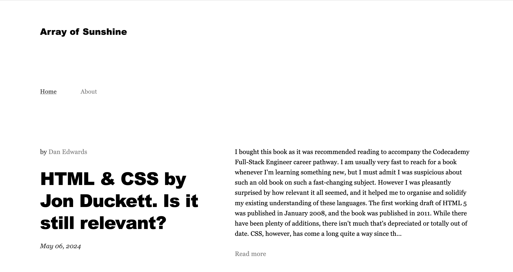
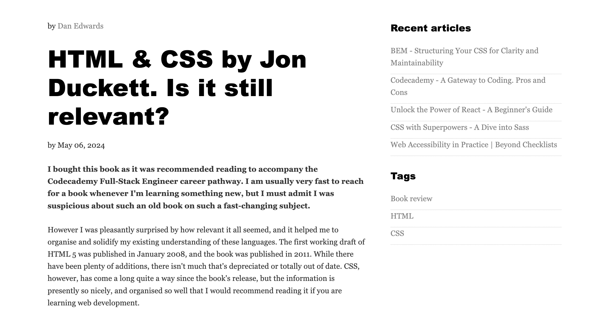
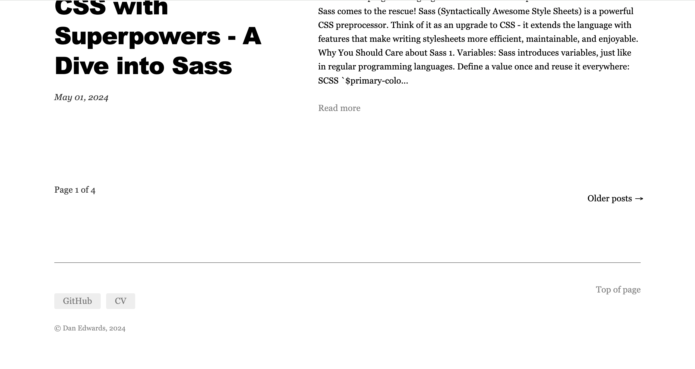

# Minimal coding blog made with React & Markdown


<p>Homepage screenshot</p>
<br />
<p>


</p>
<p>Left: Full article with dynamically rendered recent articles</p>

Tags page screenshot...

### Technologies

- React
- React router
- React markdown
- React syntax highlighter
- Redux

### Features

- Write a new article like this:

```markdown
---
title: Article title
date: September 01, 2022
writer: Dan Edwards
tags: Book review, Best practice
---

## Article content with markdown syntax

Lorem Ipsum is simply dummy text of the printing and typesetting industry. Lorem Ipsum has been the industry's standard dummy text ever since the 1500s, when an unknown printer took a galley of type and scrambled it to make a type specimen book. It has...
```

- Be careful that the meta info is formatted correctly
- Pagination.......
- Recent articles...
- Blog articles are written as .md files with metadata at the top and added to the articles folder, then they're parsed by and added to src/articles/articles.json
- Markdown is removed from the truncated previews to make the homepage look neat

### How to add a new article

1. Stop running the live server, if applicable
2. Run `src/app/generateARTICLES.js`
3. `public/ARTICLES.json` file should be rewritten including the new article. If you've copied & pasted from a different text editor, you'll need to check through the file for characters that cause problems when converted to JSON.
4. If you find any new ones (highlighted in yellow on my VS Code theme), look up the character code [here](https://www.babelstone.co.uk/Unicode/whatisit.html) and add a replace case to the `removeProblemCharacters` function in `generateARTICLES.js`
5. Everything will be taken care of dynamically. The newest post will be displayed at the top of the homepage.

#### Troubleshooting

- Check the `.md` metadata is formatted correctly. There is not much scope for error
- Check that punctuation in the title isn't causing issues with the path

### To-Do List

- [ ] Remove more characters from article slugs:
      `book-review-%7C-clean-code`
- [ ] Styling of active nav link
- [ ] Set up Error page
- [ ] Style the Error page
- [ ] Fix the Markdown code block styling
- [ ] Make the site responsive
- [ ] Add conditional loading to the article page to handle errors gracefully
- [ ] Write a test that checks that the number of objects in `articles.json` matches the number of `.md` files in `src/articles`
- [x] Add screenshot to ReadMe
- [ ] Add screenshot to Twitter OG metadata
- [ ] Demonstrate Markdown format in ReadMe
- [ ] Clean up the article content
- [ ] Style social icons into circles
- [ ] Stop the article changing when you refresh the page. Install Redux Persist
- [x] Fix about page styling
- [x] Replace the word 'author' with 'writer' everywhere for consistency
- [x] Make FilterTermPage h1 say: 'Articles by' for writers, and 'Articles tagged:' for tags
- [x] Rename TagPage FilterTermPage
- [x] Turn each writer into a page of previews by that writer
- [x] Handle edge cases for NextPrev articles. (Articles now go round in a circle. If you view the first article, the 'previous' article is the last article, and vice versa. Avoids conditional rendering and a styling issue, plus recommends more content)
- [x] Enable dynamic pagination on individual articles (NextPrev)
- [x] Remove spaces from tag slug (book%20review)
- [x] Style filter term page
- [x] Pagination on Tags pages
- [x] Implement dynamic tags section
- [x] Turn tags into links to Tag page
- [x] Clicking on site icon or Home takes you to articles page 1
- [x] Make recent article links work correctly
- [x] Display recent articles dynamically
- [x] Auto update footer copyright year with fallback
- [x] Make markdown links open in a new tab
- [x] Enable preview page sorted by tags
- [x] Design a sidebar and dynamically display other relevant blog posts
- [x] Tidy up Home page function
- [x] Display the three most recent articles in the sidebar that aren't the current article
- [x] Check article bodies for errors
- [x] Enable dynamic pagination
- [x] Add 'newer posts' link, which will be hidden on page one.
- [x] Favicon
- [x] Add line numbers to code blocks
- [x] Turn preview text into a link
- [x] Automatically scroll to the top of the page instantly when clicking on an article link
- [x] Scroll smoothly when clicking on 'top of page' internal link
- [x] Add styling to the markdown so it's consistent
- [x] Generate author links
- [x] Add code syntax highlighting using a library
- [x] Remove the word 'post' from the codebase - I prefer the term 'article' and it should be consistent for clarity
- [x] Display article tags on single article page
- [x] Display article tags on home page
- [x] Limit article previews to 5 most recent on home page
- [x] This article: HTML & CSS by Jon Duckett. Is it still relevant? isn't displaying in full for some reason, possibly because I pasted it from Notion. Fix this error. Solution: wrote a function to find and replace problem characters a weird apostrophe that isn't an apostrope, and an nbsb that looks like a space. Removed question marks from the path
- [x] Add a `removeProblemCharacters` function to `public/main.js` to prevent problems in `articles.json`
- [x] Implement dynamic page title (browser tab) changes
- [x] Buy domain name
- [x] Add a brief site description to About page
- [x] Homepage metadata
- [x] Fix punctuation replacement error. Getting `isn"t` instead of `isn't` etc. Fixed! Prettify was messing everything up - solution was to wrap punctuation in backticks.
- [x] Conditional rendering of 'Newer posts' & ''Older posts' nav as when appropriate
- [x] Dynamic page titles when using pagination nav links
- [x] Fix sidebar recent article paths
- [x] Turn each tag into a link to a page of relevant article previews
- [x] Update site title for tags & authors pages

## Nice-to-Have-but-not-Essential To-Do List

- [ ] Add fade-in animations when scrolling down the homepage (Harder than expected)
- [ ] Add copy buttons for each code block
- [ ] Scroll to the top of the <article> element when clicking on a link (This seems much harder than expected!)
- [ ] Make the search bar functional
- [ ] Organise `article.md` files into folders, ensuring they can still be read by `main.js`
- [ ] Prevent incorrect article paths from displaying an empty page
- [ ] Bracket animation on site title

<details closed>
<summary>
Useful resources

</summary> <br />
<ul>
<li>
<a href="https://www.educative.io/answers/how-to-implement-pagination-in-reactjs">Enabling pagination in React</a>
</li>
<li>
<a href="https://codepen.io/adatg/pen/BGLVGL?editors=0100">CSS Bracket hover animation</a>
</li>
<li>
<a href="https://www.codecademy.com/learn/learn-react-router/modules/learn-react-router/cheatsheet">Codecademy React Router cheatsheet</a>
</li>
</ul>
</details>
